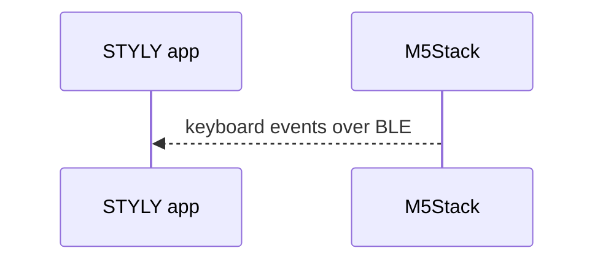
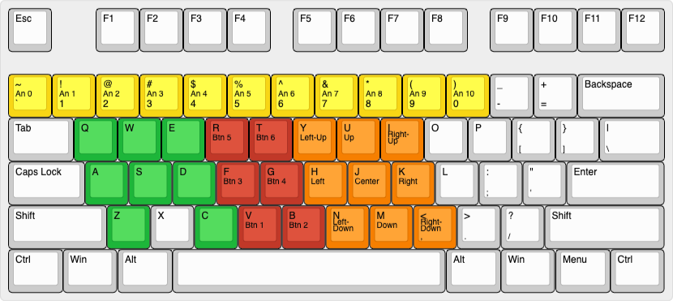
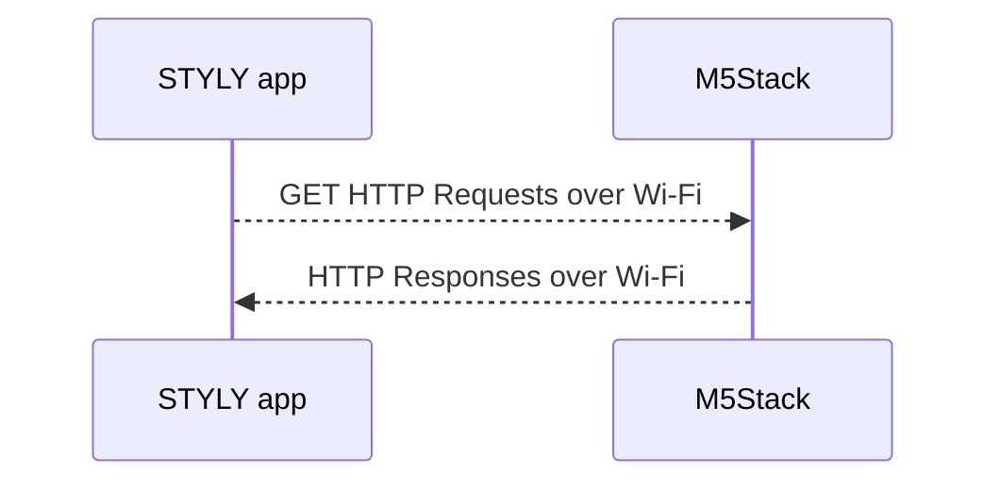

# I/O Framework for xR

This project is a framework for xR creators to extend inputs and outputs easily beyond the capabilities of conventional devices.

The framework consists of firmware for M5Stack and an SDK for Unity with the STYLY plugin. The M5Stack toolkit allows you to easily create IoT projects by connecting various sensors and actuators without soldering. The controller functions as a Bluetooth keyboard and a Wi-Fi server, sending keyboard events to a device such as a smartphone in response to input from sensors. Moreover, you can control actuators by sending HTTP requests to the controller.

With this framework, you may be able to expand your imagination of the concept of xR and realize your ideas as works.

---

本プロジェクトは、xRクリエーターが、従来のデバイスの能力を超える入出力を簡単に拡張するためのフレームワークです。

フレームワークは、M5Stack用のファームウェアと、STYLYプラグインを組み込んだUnity用のSDKで構成されています。M5Stackは、各種センサーやアクチュエーターをハンダづけなしで接続し、IoTプロジェクトを簡単に作成できるツールキットです。コントローラは、BluetoothキーボードおよびWi-Fiサーバーとして機能し、センサーからの入力に応じてキーボードイベントをスマートフォンなどのデバイスに送信します。さらに、コントローラにHTTPリクエストを送ることで、アクチュエータを制御できます。

このフレームワークを使うことにより、xRの概念に対する想像力を膨らませ、アイデアを作品として実現できるかもしれません。

## Status

:construction: Heavily work in progress; therefore, only for experimental purposes :construction:

### Supported Units

#### Sensors

- [Mini Dual Button Unit](https://shop.m5stack.com/collections/m5-unit/products/mini-dual-button-unit)
- [Light Sensor Unit](https://shop.m5stack.com/collections/m5-unit/products/light-sensor-unit)
- [Mini Angle Unit](https://shop.m5stack.com/products/angle-unit)
- [I2C Joystick Unit V1.1](https://shop.m5stack.com/collections/m5-sensor/products/i2c-joystick-unit-v1-1-mega8a)
- [Distance Ranging Sensor Unit](https://shop.m5stack.com/products/tof-sensor-unit)
- [TVOC/eCO2 Gas Sensor Unit](https://shop.m5stack.com/products/tvoc-eco2-gas-unit-sgp30)
- [RFID 2 Unit](https://shop.m5stack.com/collections/m5-sensor/products/rfid-unit-2-ws1850s)
- [Gesture recognition sensor](https://shop.m5stack.com/products/unit-gesture-recognition-sensor-paj7620u2)
- [12 Key Capacitive I2C Touch Sensor V3](https://www.seeedstudio.com/Grove-12-Key-Capacitive-I2C-Touch-Sensor-V3-MPR121-p-4694.html) by Seeed Studio

#### Actuators

- [Servo Kit 180° Brick-compatible](https://shop.m5stack.com/collections/m5-accessories/products/servo-kit-180)
- [Vibration Motor Unit](https://shop.m5stack.com/products/vibration-motor-unit)

### Supported platforms

:warning: **Not thoroughly tested yet.**

- iOS/iPadOS - [STYLY](https://itunes.apple.com/jp/app/id1477168256?mt=8) app
- Android - [STYLY](https://play.google.com/store/apps/details?id=com.psychicvrlab.stylymr) app
- Oculus Quest 2 - [STYLY](https://www.oculus.com/experiences/quest/3982198145147898/) app (from App Lab)
- Windows - [STYLY VR](https://store.steampowered.com/app/693990/STYLYVR_PLATFORM_FOR_ULTRA_EXPERIENCE/) app
- Windows - Chrome
- macOS - Chrome

#### Known issues

- [ ] Bluetooth keyboard input doesn't work with the STYLY app v9.0.4 on iOS.

### Supported combinations (maximum)

The connected Unit(s) input is transmitted on three different channels: analog, joystick, and buttons. The analog and joystick channels can handle up to one sensor Unit input for each at once, and the buttons channel can handle up to six button inputs simultaneously.

| Pattern \ Unit | Gesture | Joystick | Touch  | RFID   | Gas    | Ranging | Dual Button | Analog In | Servo/Vibrator |
| :------------- | :------ | :------- | :----- | :----- | :----- | :------ | :---------- | :-------- | :------------- |
| A              | :bulb:  |          |        |        | :bulb: |         |             |           | :bulb:         |
| B              | :bulb:  |          |        |        |        | :bulb:  |             |           | :bulb:         |
| C              | :bulb:  |          |        |        |        |         |             | :bulb:    |                |
| D              |         | :bulb:   | :bulb: |        | :bulb: |         | :bulb:      |           |                |
| E              |         | :bulb:   | :bulb: |        |        | :bulb:  | :bulb:      |           |                |
| F              |         | :bulb:   |        | :bulb: | :bulb: |         | :bulb:      |           |                |
| G              |         | :bulb:   |        | :bulb: |        | :bulb:  | :bulb:      |           |                |
| H              |         | :bulb:   | :bulb: |        | :bulb: |         |             |           | :bulb:         |
| I              |         | :bulb:   | :bulb: |        |        | :bulb:  |             |           | :bulb:         |
| J              |         | :bulb:   | :bulb: |        |        |         |             | :bulb:    |                |
| K              |         | :bulb:   |        | :bulb: | :bulb: |         |             |           | :bulb:         |
| L              |         | :bulb:   |        | :bulb: |        | :bulb:  |             |           | :bulb:         |
| M              |         | :bulb:   |        | :bulb: |        |         |             | :bulb:    |                |
| `Port`         | `A`     | `A`      | `A`    | `A`    | `A`    | `A`     | `B`         | `B`       | `B`            |

#### Notes

- If you want to connect multiple Units to port A, please connect via a [1 to 3 HUB Expansion Unit](https://shop.m5stack.com/collections/m5-unit/products/mini-hub-module).
- When a Ranging Sensor Unit is connected, you can't use a Joystick Unit nor Gas Sensor Unit.
- To change the connection, make sure to turn off the power (i.e., M5Stack Fire: double-clicking the power button, M5Stack Core 2: pressing the power button for 6 seconds). You cannot turn it off while your controller is connected to a USB port.

## How to try

### Download

1. Download M5Burner v3.0 for your platform from [the official website](https://docs.m5stack.com/en/download)
2. Extract and launch the M5Burner (move to your Applications folder before launching on macOS)
3. Choose "I/O Framework for xR" from the projects
4. Click on the `Download` button of the project
5. Once finished downloading, the `Download` button becomes the `Burn` button
6. Click on the `Burn` button
7. Choose the serial port in the `COM` field and click on the `Start` button to burn the firmware

### Setup Wi-Fi

1. Install EspTouch for [iOS](https://apps.apple.com/app/espressif-esptouch/id1071176700) or [Android](https://github.com/EspressifApp/EsptouchForAndroid/releases/tag/v2.0.0/esptouch-v2.0.0.apk) (choose the `esptouch-v2.0.0.apk`) to your smartphone
2. Connect your smartphone to the Wi-Fi router
3. Open your EspTouch app
4. Input the router’s password on the EspTouch app
5. Power on (or reboot) your M5Stack and press the A button within three seconds
6. Tap the `Confirm` button on the EspTouch app and wait for a while
7. You will see an IP address on the screen of the M5Stack

### Test

1. Choose a pattern from the table above and connect Unit(s) to your M5Stack controller (e.g., M5Stack FIRE)
2. Power on your M5Stack controller
3. If you want to use a Unit to be connected to Port B, please refer to the "How to setup" section and setup (Units to be connected to Port A will be recognized automatically)
4. Connect the controller as a Bluetooth device to your device (please follow standard instruction for the device)
5. Open the [IOFrameworkWidget (BLE and Wi-Fi)](https://gallery.styly.cc/scene/dd6b5c48-bb91-46e6-ab01-0f964d96de24) scene in a browser and bring the browser frontmost
6. Press the `Send` (C) button to start sending
7. Control the joystick, sensor, etc.
8. Once confirmed, press the `Stop` (C) button again to stop sending

### Setup

#### PORT B

1. Press the `Setup` (A) button to enter the preferences screen
2. Press the `Next` (C) button (if needed) to choose the `PORT B: NONE` line
3. Press the `Go` (B) button
4. Press the `-` (A) or `+` (C) button to be matched to the device connected to the Port B (i.e., `DUAL BUTTON`, `ANALOG IN`[^ANALOG_IN], `SERVO` or `VIBRATOR`)
5. Press the `Done` (B) button
6. Press the `Exit` (A) button to back to the main screen

[^ANALOG_IN]: If you want to connect Units to be connected to Port B and use `A.OUT` such as LIGHT, ANGLE etc., please choose this option.

#### RFID Tags

1. Press the `Setup` (A) button to enter the preferences screen
2. Press the `Next` (C) button (if needed) to choose the `RFID 1: **:**:**:**` line
3. Press the `Go` (B) button
4. Press the `Reset` (C) button
5. Put an RFID Tag on the RFID Unit, then remove the Tag
6. Press the `Next` (C) button to choose the next line
7. Repeat from step 3 for 3 times to register the remaining 3 RFID Tags
8. Press the `Exit` (A) button to back to the main screen

### Troubleshooting

- "IO Framework M5" is shown as connected but no input to the STYLY scene. → Please try to unpair the controller in the Bluetooth preference and pair it again.
- Bluetooth connection status on my controller keeps switching between `Connected` and `Disconnected` when not connected. → The controller might have been paired with an old host (i.e., a PC or smartphone). If you no longer use the controller with the host, please remove the device from the host.

## Bluetooth keyboard protocol

- Keys in green: used in STYLY Web Player
- Keys in yellow: used for the Analog channel
- Keys in orange: used for the Joystick channel
- Keys in red: used for the Buttons channel

### Analog channel

| Analog value | Key     |
| :----------- | :------ |
| 0            | `` ` `` |
| 1            | `1`     |
| 2            | `2`     |
| 3            | `3`     |
| 4            | `4`     |
| 5            | `5`     |
| 6            | `6`     |
| 7            | `7`     |
| 8            | `8`     |
| 9            | `9`     |
| 10           | `0`     |

### Joystick channel

| Joystick   | Key |
| :--------- | :-- |
| Left-Up    | `y` |
| Up         | `u` |
| Right-Up   | `i` |
| Left       | `h` |
| Center     | `j` |
| Right      | `k` |
| Left-Down  | `n` |
| Down       | `m` |
| Right-Down | `,` |

### Buttons channel

| No. | Name  | Key | Assigned input     |
| :-- | :---- | :-- | :----------------- |
| 1   | Fire1 | `v` | Dual Button - Red  |
| 2   | Fire2 | `b` | Dual Button - Blue |
| 3   | Fire3 | `f` | Touch Sensor - CH0 |
| 4   | Jump  | `g` | Touch Sensor - CH1 |
| 5   |       | `r` | Touch Sensor - CH2 |
| 6   |       | `t` | Touch Sensor - CH3 |

### Joystick and Buttons channel (for Gesture sensor only)

| Joystick | Key |
| :------- | :-- |
| Up       | `u` |
| Left     | `h` |
| Right    | `k` |
| Down     | `m` |

| No. | Name  | Key | Assigned input          |
| :-- | :---- | :-- | :---------------------- |
| 1   | Fire1 | `v` | Gesture - Forward       |
| 2   | Fire2 | `b` | Gesture - Backward      |
| 3   | Fire3 | `f` | Gesture - Clockwise     |
| 4   | Jump  | `g` | Gesture - AntiClockwise |
| 5   |       | `r` | Gesture - Wave          |

## Wi-Fi protocol

### Get input values

`GET` `http://{ip_address}/input`

`{analog value},{joystick value},{button 1 value},{button 2 value},{button 3 value},{button 4 value},{button 5 value},{button 6 value},`

Example:

`9,Left,0,1,0,0,0,0`

### Set output value

`GET` `http://{ip_address}/output?val={value}`

- `SERVO`: `{value}` is servo angle in degree, between 0 and 180
- `VIBRATOR`: `{value}` is on duration in ms, between 0 and 100

Example:

`GET` `http://192.168.0.10/output?val=123`

## I/O Framework SDK for Unity

The SDK consists of components as follows.

- `IOFrameworkManager` is a manager for the I/O Framework
- `IOFrameworkTestUI` is a UI to test the framework
- `IOFrameworkAnalogHandler` is a handler for events in the analog channel
- `IOFrameworkJoystickHandler` is a handler for events in the joystick channel
- `IOFrameworkButtonsHandler` is a handler for events in the buttons channel
- `IOFrameworkGestureHandler` is a handler for events from a Gesture sensor (in both joystick and buttons channel)
- `IOFrameworkOutputHandler` is a handler for events in the output channel via Wi-Fi

### Usage

1. Import the `IOFrameworkSDK.unitypackage` file to your Unity project
2. Instantiate an `IOFrameworkManager`
3. Instantiate an `IOFrameworkTestUI` as a Child of the `IOFrameworkManager` object if necessary
4. Instantiate a handler from handlers in the SDK (e.g., `IOFrameworkAnalogHandler`) as a Child of the `IOFrameworkManager` object
5. Unpack the handler
6. Navigate PlayMaker editor to the FSM of the handler and edit for your scene

### Input

IOFrameworkManager broadcasts events to all FSMs.

- `ANALOG VALUE CHANGED` Int: analog value
- `JOYSTICK VALUE CHANGED` String: joystick value
- `BUTTON 1 DOWN`
- `BUTTON 1 UP`
- `BUTTON 2 DOWN`
- `BUTTON 2 UP`
- `BUTTON 3 DOWN`
- `BUTTON 3 UP`
- `BUTTON 4 DOWN`
- `BUTTON 4 UP`
- `BUTTON 5 DOWN`
- `BUTTON 5 UP`
- `BUTTON 6 DOWN`
- `BUTTON 6 UP`

### Output

Send events to `IOFrameworkManager: Event Handlers FSM`.

- `SET OUTPUT VALUE REQUEST` String: output value

### Wi-Fi

IOFrameworkManager broadcasts events to all FSMs.

- `HTTP RESPONSE` String: HTTP response

Send events to `IOFrameworkManager: Event Handlers FSM`.

- `SET IP ADDRESS` String: IP address

Send events to `IOFrameworkManager: HTTP Request Loop FSM`.

- `START LISTENING`
- `STOP LISTENING`
- `LISTEN ONCE`

## Requirements (for developers)

### Preparing the development environment

- English: [Arduino IDE environment - M5Core](https://docs.m5stack.com/en/quick_start/m5core/arduino)
- Chinese (simplified): [Arduino IDE 环境搭建 - M5Core](https://docs.m5stack.com/zh_CN/quick_start/m5core/arduino)

### Libraries

- [M5Unified](https://github.com/m5stack/M5Unified) v0.0.7 by M5Stack
- [M5GFX](https://github.com/m5stack/M5GFX) v0.0.20 by M5Stack
- [ESP32 BLE Keyboard library](https://github.com/T-vK/ESP32-BLE-Keyboard/) v0.3.0 by T-vK
- [VL53L0X library for Arduino](https://github.com/pololu/vl53l0x-arduino) v1.3.1 by Pololu[^VL53L0X]
- [Adafruit SGP30 Gas / Air Quality I2C sensor](https://github.com/adafruit/Adafruit_SGP30) v2.0.0 by Adafruit
- [Adafruit MPR121 Library](https://github.com/adafruit/Adafruit_MPR121) v1.1.1 by Adafruit
- [ESP32Servo](https://www.arduinolibraries.info/libraries/esp32-servo) v0.11.0 by Kevin Harrington and John K. Bennett
- [ServoEasing](https://github.com/ArminJo/ServoEasing) v3.0.0 by Armin Joachimsmeyer
- [DFRobot_PAJ7620](https://github.com/DFRobot/DFRobot_PAJ7620U2) v1.0.1 by DFRobot

[^VL53L0X]: Make sure to install the one by Pololu, not by Adafruit.

### How to install

#### The ESP32 BLE Keyboard library

1. Download the ZIP file at the [ESP32-BLE-Keyboard v0.3.0](https://github.com/T-vK/ESP32-BLE-Keyboard/releases/tag/0.3.0) page (you don’t have to extract it after downloading)
2. In the Arduino IDE, navigate to Sketch → Include Library → Add .ZIP Library...
3. Select the file you just downloaded

#### Other libraries

1. In the Arduino IDE, navigate to Tools → Manage Libraries...
2. Type in a part of each library (e.g., `VL53L0X`, `Adafruit SGP30` etc.) in the text field in the top right corner, choose the right library and press the install button
3. Repeat the second step for all required libraries

## Credits

- The included MFRC522 I2C Library is from the [RFID_RC522 example](https://github.com/m5stack/M5Stack/tree/master/examples/Unit/RFID_RC522) in the public domain, originally developed by [arozcan](https://github.com/arozcan/MFRC522-I2C-Library) based on the findings of the pioneers and modified by M5Stack.
- The technique for detecting that an RFID tag has been removed was implemented by referring to [the example proposed by uluzox](https://github.com/miguelbalboa/rfid/issues/188#issuecomment-495395401) and modified for cooperative multitasking
